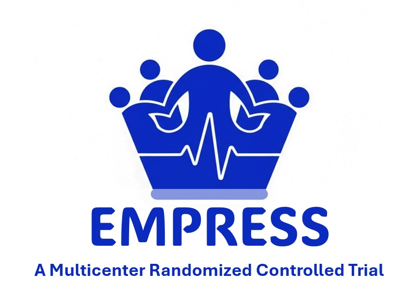

  
  <h1 class="hero-title">EMPRESS Research Network</h1>
  

    以感染性休克与血管麻痹临床研究为核心的多中心科研协作网络 
    第一个研究项目：EMPRESS 多中心随机对照试验
  

  

    注册号 ChiCTR2500112352
    方案发表于 SJTREM 2026;34:44
    多中心 · 国际协作
  

## 关于网络

EMPRESS Research Network 是由四川省医学科学院·四川省人民医院重症医学中心牵头发起的多中心、国际协作临床研究网络，聚焦感染性休克、血管麻痹与儿茶酚胺节约治疗等危重症领域的关键科学问题。网络以高质量多中心临床试验为核心任务，同时承担方法学支持、数据治理与研究者培训职能。

[了解更多 →](about.html)

## 研究项目

  <h3>EMPRESS 研究首个研究项目</h3>
  
<strong>早期应用亚甲蓝改善依赖高剂量升压药支持的感染性休克患者病死率</strong>——一项研究者发起、多中心、开放标签、终点设盲的随机对照试验（566 例；主要终点：28 天全因病死率；注册号 ChiCTR2500112352）。

  
<a class="btn-dl primary" href="studies/empress.html">查看研究详情</a>

## 治理架构

  

    <h3>指导委员会</h3>
    
把握科学方向，审批方案修订与关键决策。

    
<a href="governance.html#steering">查看成员 →</a>

  

  

    <h3>协调委员会</h3>
    
负责网络日常运营、中心协调与数据质量管理。

    
<a href="governance.html#coordinating">查看成员 →</a>

  

  

    <h3>数据安全监查委员会</h3>
    
独立监查研究安全性与有效性数据。

    
<a href="governance.html#dsmb">查看成员 →</a>

  

## 发布文件

- 研究方案（中文 / 英文 PDF，含 DOI 在线访问）
- 统计分析计划（SAP，待发布）
- 中期报告（待发布）
- 发表文献

[前往发布文件页 →](documents.html)

## 最新动态

<ul class="timeline">
  <li>2026多中心启动与受试者入组进行中进行中</li>
  <li>2026EMPRESS 研究方案正式发表（SJTREM 2026;34:44，开放获取）已发表</li>
  <li>2026-01-19方案被期刊接收已完成</li>
  <li>2025-11-12中国临床试验注册中心注册（ChiCTR2500112352）已完成</li>
  <li>2025中央伦理委员会批准（批准号 2025-583）已完成</li>
</ul>

## 联系我们

如有研究合作、入组咨询或信息更正需求，欢迎通过[联系我们](contact.html)页面与网络秘书处或通讯作者取得联系。
